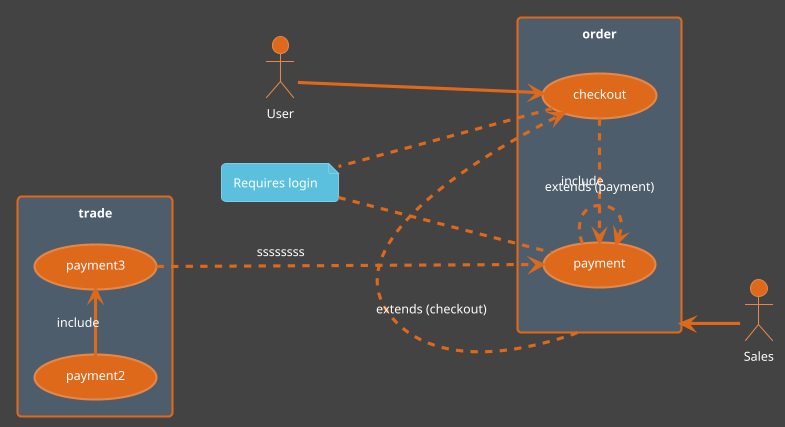
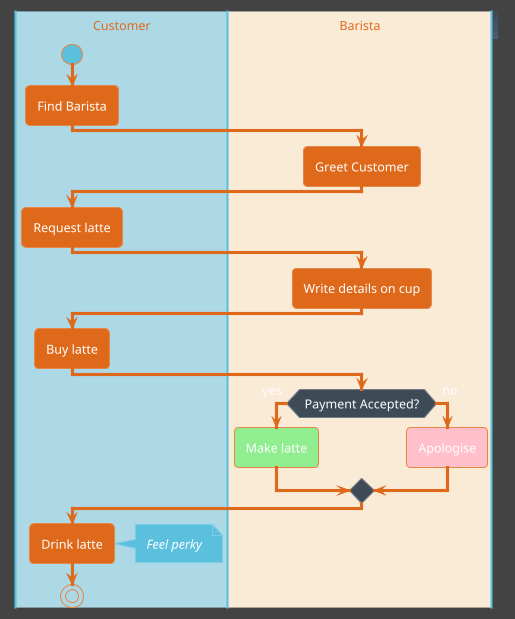
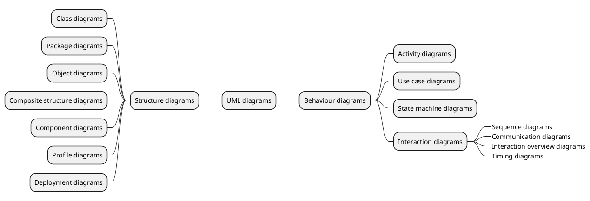

```plantuml
@startuml
!theme superhero
skinparam backgroundColor #434343
left to right direction
skinparam packageStyle rectangle
actor User
actor Sales
rectangle order {
  User --> (checkout)
  (checkout) .> (payment) : include
  (order) .> (checkout) : extends (checkout)
  (order) <-- Sales
}
note "Requires login" as N2
  (checkout) .. N2
  N2 .. (payment)
  
rectangle trade {
   (payment2) -> (payment3) : include
   (payment) .> (payment) : extends (payment)
   (payment3) ...> (payment): ssssssss
}
@enduml
```

```plantuml
@startuml
!theme superhero
skinparam backgroundColor #434343
|#lightblue|Customer|
start
:Find Barista;
|#antiquewhite|Barista|
:Greet Customer;
|Customer|
:Request latte;
|Barista|
:Write details on cup;
|Customer|
:Buy latte;
|Barista|
if (Payment Accepted?) then (yes)
#lightgreen:Make latte;
else (no)
#pink:Apologise;
endif
|Customer|
:Drink latte;
note right
  //Feel perky//
end note
stop
@enduml
```

```plantuml
@startuml
!theme cerulean-outline
skinparam backgroundColor #434343
@startmindmap
+ UML diagrams
++ Behaviour diagrams
+++ Activity diagrams
+++ Use case diagrams
+++ State machine diagrams
+++ Interaction diagrams
++++_ Sequence diagrams
++++_ Communication diagrams
++++_ Interaction overview diagrams
++++_ Timing diagrams
-- Structure diagrams
--- Class diagrams
--- Package diagrams
--- Object diagrams
--- Composite structure diagrams
--- Component diagrams
--- Profile diagrams
--- Deployment diagrams
@endmindmap
@enduml

```