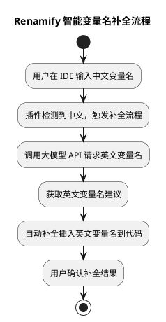

# Renamify 插件原理与流程说明

## 一、项目简介
Renamify 是一个基于大模型（如 GPT-4）实现的智能变量名自动补全插件。
其主要功能是在用户输入中文变量名时，自动调用大模型，将其动态转换为语义合理的英文变量名并进行补全，提升代码国际化和可读性。

## 二、核心原理

1. **输入检测**：插件监听用户在 IDE 中输入变量名的行为，识别出中文变量名。
2. **大模型交互**：检测到中文输入后，插件通过网络接口（如 OpenAI API）与大模型进行交互，请求将中文变量名翻译为有意义且符合编程规范的英文变量名。
3. **结果处理与补全**：大模型返回英文变量名后，插件自动将其作为补全建议插入到代码编辑器中，实现无缝替换与补全。
4. **用户体验优化**：支持多种命名风格（如 camelCase、snake_case），确保生成的变量名与项目规范保持一致。

## 三、主要流程

- 用户在 IDE 输入中文变量名
- 插件检测到中文输入，触发补全流程
- 构造请求并发送至大模型 API
- 大模型返回英文变量名建议
- 插件将英文变量名补全到代码编辑器
- 用户选择并确认补全结果

## 四、流程图说明

下方为 Renamify 插件整体流程的 PlantUML 活动图

如需进一步了解插件实现细节，请参考上述核心代码文件。